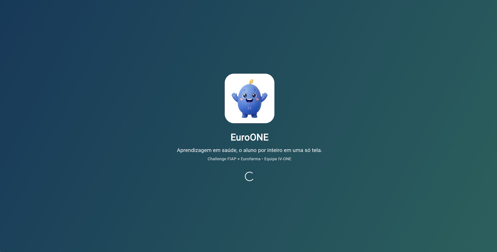
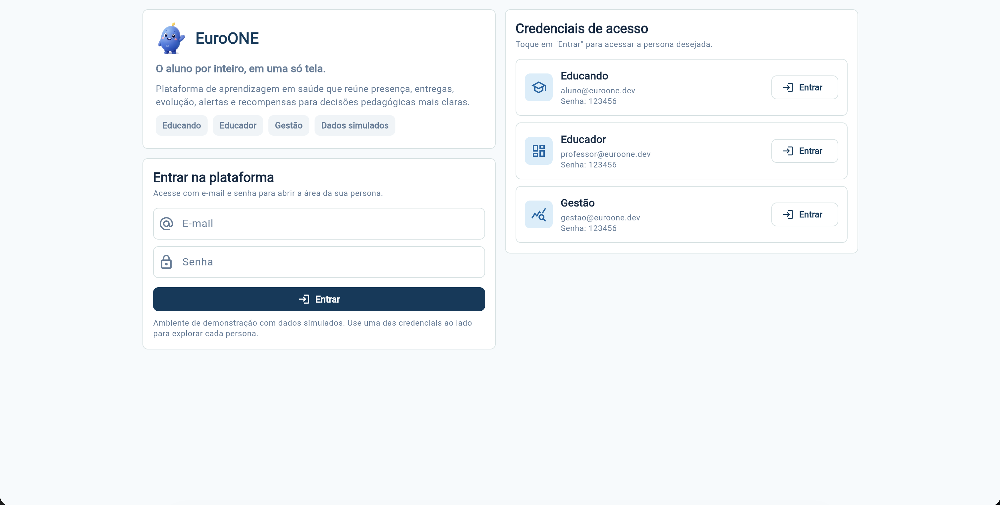
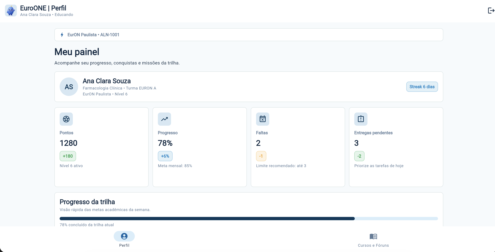
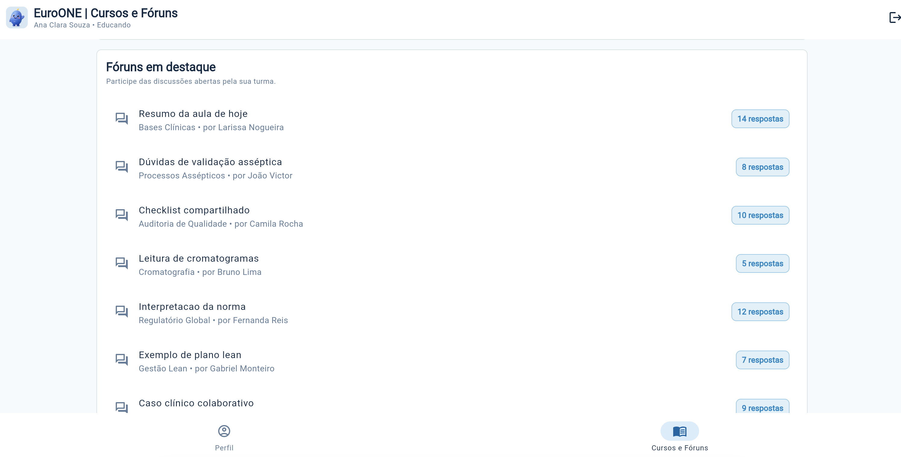
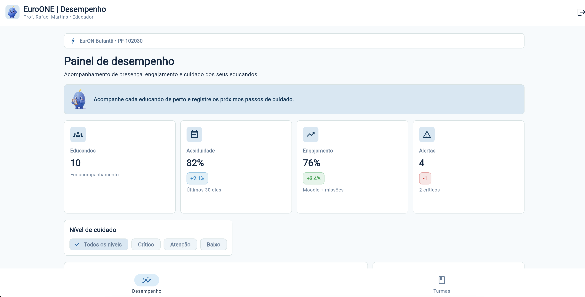
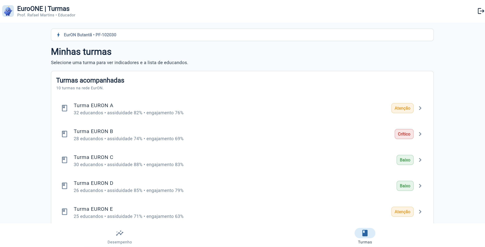
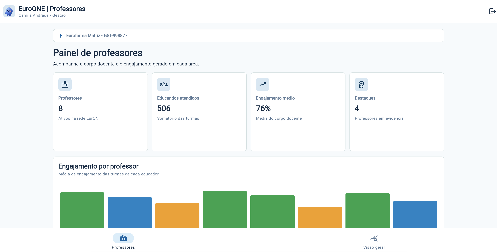
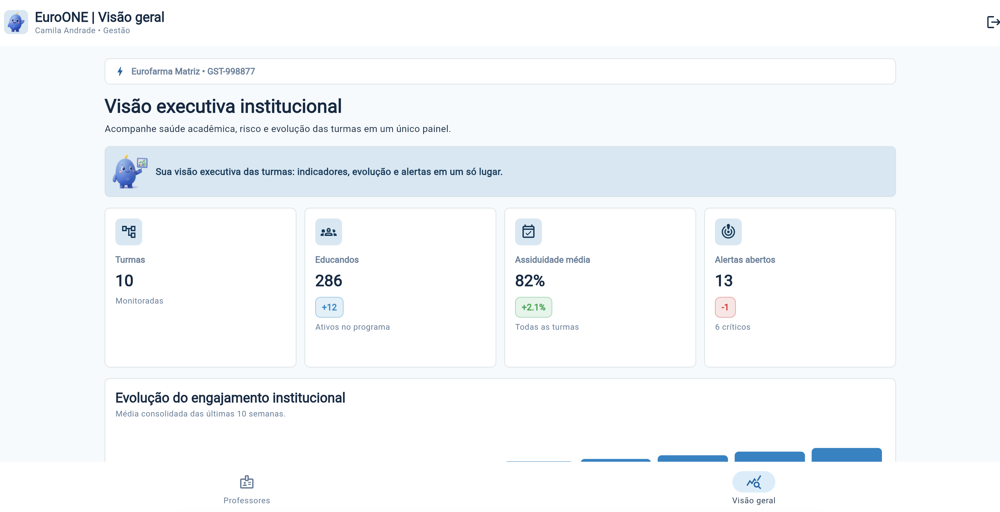

# EuroONE

Aplicativo Flutter desenvolvido para o **Challenge FIAP × Eurofarma**. O EuroONE é uma
plataforma de aprendizagem em saúde que reúne, em um só lugar, a jornada do aluno,
o acompanhamento pedagógico do professor e a visão executiva da gestão.

> **Importante:** esta é uma versão MVP/protótipo navegável. Todos os dados são
> **mockados/simulados** e ficam organizados em classes e listas no código
> (`lib/core/data/mock_data.dart`). Não há integração com API, banco de dados,
> Firebase ou qualquer backend.

## Equipe

- **Equipe:** IV-ONE
- **Integrantes:**
  - Guilherme Tusita
  - Matheus Hadermeck
  - Lucas Correa
  - Karine Nascimento

## Objetivo do aplicativo

Oferecer uma experiência única de acompanhamento acadêmico em saúde, com navegação
baseada no perfil (persona) de cada usuário:

- **Educando (aluno):** acompanha seu perfil, progresso, conquistas e seus cursos e fóruns.
- **Educador (professor):** monitora o desempenho dos alunos e gerencia suas turmas.
- **Gestão (administrador):** acompanha o corpo docente e a visão consolidada de alunos e métricas.

## Repositório

- GitHub: <https://github.com/Tusitaa/eurone-sprint-flutter>

## Vídeo de demonstração

- Link do vídeo da navegação: **_(inserir o link aqui)_**

## Credenciais de acesso (mock)

As credenciais são exibidas diretamente na tela de login. Todas usam a senha `123456`:

| Persona  | E-mail                  | Senha    |
|----------|-------------------------|----------|
| Educando | `aluno@euroone.dev`     | `123456` |
| Educador | `professor@euroone.dev` | `123456` |
| Gestão   | `gestao@euroone.dev`    | `123456` |

## Telas do aplicativo

### Apresentação e acesso

- **Splash / Apresentação** — tela inicial com a identidade do EuroONE e transição para o login.

  

- **Login** — acesso por e-mail e senha, com as credenciais das três personas visíveis na tela.

  

### Educando

- **Perfil** — dados do usuário, progresso da trilha, conquistas/itens adquiridos e missões em andamento.

  

- **Cursos e Fóruns** — lista unificada de cursos e tópicos de fórum. Cada item abre uma tela de detalhe.

  

- **Detalhe do curso** — disciplinas, aulas e fóruns vinculados ao curso selecionado.
- **Detalhe do fórum** — tópico com as mensagens da turma.

### Educador

- **Desempenho** — indicadores da turma, gráfico de Presença × Engajamento, QR de check-in
  e lista de acompanhamento individual dos alunos.

  

- **Turmas** — visualização e gestão rápida das turmas do educador.

  

- **Detalhe do aluno** — indicadores e plano de cuidado do educando selecionado.
- **Detalhe da turma** — indicadores da turma e lista de educandos.

### Gestão

- **Painel de professores** — informações do corpo docente e gráfico estatístico de engajamento por professor.

  

- **Visão geral** — métricas do sistema, gráfico de evolução institucional, saúde das turmas,
  quedas de engajamento e alertas consolidados.

  

- **Detalhe do professor** — indicadores e disciplinas do professor selecionado.
- **Detalhe da turma** — indicadores da turma e lista de educandos.

## Fluxo de navegação

`Splash → Login → Home da persona → Listagem → Detalhe (com passagem de parâmetro)`

Exemplos de navegação com passagem de parâmetro (id do item):

- Educando: curso/fórum da lista → tela de detalhe correspondente.
- Educador: aluno/turma → detalhe do aluno/turma.
- Gestão: professor/turma → detalhe do professor/turma.

## Como executar

Pré-requisitos: [Flutter](https://docs.flutter.dev/get-started/install) instalado
(canal estável) e um emulador Android ou dispositivo físico conectado.

```bash
# 1. Instalar as dependências
flutter pub get

# 2. (opcional) Conferir a saúde do ambiente
flutter doctor

# 3. Executar o aplicativo
flutter run
```

Para validar a qualidade do código:

```bash
flutter analyze
flutter test
```

## Arquitetura e organização

O projeto segue uma organização por camadas e por funcionalidade (feature):

```
lib/
├── app/                  # App, tema e rotas (go_router)
├── core/
│   ├── data/             # Dados mockados (mock_data.dart)
│   └── models/           # Modelos de dados (AppUser, Curso, Turma, Professor, ...)
├── features/
│   ├── splash/           # Tela de apresentação
│   ├── auth/             # Login e autenticação mock
│   ├── educando/         # Perfil + Cursos e Fóruns (+ detalhes)
│   ├── educador/         # Desempenho + Turmas (+ detalhes)
│   ├── gestao/           # Professores + Visão geral (+ detalhes)
│   └── shared_detail/    # Telas de detalhe compartilhadas (turma)
└── shared/
    ├── responsive/       # Grid responsivo
    └── widgets/          # Componentes reutilizáveis (cards, painéis, gráficos, shells)
```

### Tecnologias

- Flutter e Dart
- flutter_riverpod (gerência de estado)
- go_router (navegação e rotas com parâmetros)
- qr_flutter (QR Code de check-in de aula)
- Gráficos e indicadores construídos com widgets nativos do Flutter (sem
  dependência externa de gráficos)
- Mascote "Euri" como elemento visual de identidade (arte em `assets/images/`)
